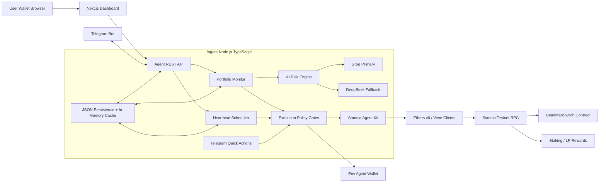

---
stepsCompleted:
  - 1
  - 2
  - 3
  - 4
  - 5
  - 6
  - 7
  - 8
inputDocuments:
  - _bmad-output/planning-artifacts/prd.md
  - _bmad-output/planning-artifacts/prd-validation-report.md
workflowType: 'architecture'
lastStep: 8
status: 'complete'
completedAt: '2026-05-10'
project_name: 'Somnia RiskGuard Agent'
user_name: 'tug'
date: '2026-05-10'
---

# Architecture Decision Document

_This document builds collaboratively through step-by-step discovery. Sections are appended as we work through each architectural decision together._

## Project Context Analysis

### Requirements Overview

**Functional Requirements:**
Somnia RiskGuard Agent requires a separated full-stack architecture that supports wallet setup, portfolio monitoring, AI Risk Score generation, Telegram alerting, authenticated quick actions, heartbeat tracking, Dead Man's Switch state, constrained reward claiming, dashboard visibility, demo simulation, and audit-friendly operations.

The functional requirements imply at least three major runtime surfaces: a backend agent for monitoring and execution, a frontend dashboard for setup and overview, and smart contracts for Dead Man's Switch enforcement. A fourth supporting surface is demo/simulation tooling, because Agentathon judging requires deterministic flows for risk alerts, reward claims, heartbeat expiry, and timelock visibility.

**Non-Functional Requirements:**
The strongest architecture drivers are security, reliability, and auditability. The system must separate user browser wallet responsibilities from backend agent wallet execution, load all secrets from environment variables, fail closed on invalid runtime configuration, and prevent LLM output from directly authorizing transactions. Telegram quick actions require authentication and replay protection. Contract state must be readable by both agent and dashboard.

Performance targets are demo-oriented: Risk Score generation within 10 seconds, Telegram alert delivery within 15 seconds, and dashboard setup within 3 minutes. The validation report flags that NFRs need stronger verification methods, so the architecture should explicitly define testable controls for secret scanning, policy-gate tests, replay tests, audit-log tests, and failure-mode tests.

**Scale & Complexity:**

- Primary domain: full-stack Web3 AI agent
- Complexity level: high
- Estimated architectural components: 8 core components

Core components:
- Frontend dashboard
- Backend agent runtime
- Portfolio monitor
- LLM risk engine
- Telegram notification/action service
- On-chain policy and execution service
- Dead Man's Switch smart contract
- Demo/simulation and observability layer

### Technical Constraints & Dependencies

The architecture must respect the project boundaries already defined in the repository:

- `/agent`: Node.js + TypeScript backend agent
- `/frontend`: Next.js 15 App Router dashboard
- `/contracts`: Solidity Dead Man's Switch contract
- `ethers.js v6`: blockchain provider, signer, and contract interaction
- Groq: primary LLM provider
- DeepSeek: fallback LLM provider
- Telegram Bot API: alerts and quick action buttons
- Somnia Testnet: primary chain environment
- Local/demo simulation mode: deterministic Agentathon demo flows

The backend agent uses a dedicated environment-loaded agent wallet for safe actions. The frontend uses browser wallet connection only and must not request or store private keys. All chain IDs, RPC URLs, contract addresses, wallet addresses, provider keys, thresholds, and tokens must be environment-driven or user-configured through safe setup flows.

### Cross-Cutting Concerns Identified

- Secret management and startup configuration validation
- Transaction policy gates before every signature
- LLM output isolation from execution authority
- Telegram action authentication and replay prevention
- Dead Man's Switch false-trigger prevention
- Smart contract access control and timelock correctness
- Audit-friendly logs without secret leakage
- Provider failure handling for Groq, DeepSeek, Telegram, RPC, signer, and contracts
- Clear separation of simulated demo behavior from Somnia Testnet behavior
- Beneficiary-safe UX for non-technical users
- Fintech/Web3 compliance posture and abuse-case threat modeling

## Starter Template Evaluation

### Primary Technology Domain

The project is a full-stack Web3 AI agent system with three implementation workspaces: `/agent`, `/frontend`, and `/contracts`. A single full-stack starter is not a good fit because the product has distinct backend agent, dashboard, and smart contract runtimes. The architecture should use a root-level pnpm workspace with focused starters per surface.

### Current Docs Checked

- pnpm workspace configuration: https://pnpm.io/pnpm-workspace_yaml
- Foundry `forge init`: https://getfoundry.sh/forge/reference/init/
- Next.js `create-next-app`: https://nextjs.org/docs/app/api-reference/cli/create-next-app
- shadcn/ui Next.js install: https://ui.shadcn.com/docs/installation/next
- viem installation: https://viem.sh/docs/installation
- node-cron package/docs: https://www.npmjs.com/package/node-cron and https://nodecron.com/getting-started.html

### Starter Options Considered

**Option 1: Single Next.js/shadcn monorepo starter**

This provides fast dashboard setup and shadcn/ui integration, but it does not naturally model the backend agent runtime or Solidity contract workspace. It risks making the dashboard the center of gravity when the agent and contract safety layers are equally important.

**Option 2: Hardhat contract starter plus custom Node/Next setup**

Hardhat remains viable for teams that prefer TypeScript-driven contract tests and deployment tasks. For this project, Foundry is preferred because the Agentathon MVP benefits from fast Solidity-first iteration, Anvil local simulation, and concise contract tests.

**Option 3: Foundry contracts plus root pnpm workspace**

Use pnpm as the single package manager for the entire repository. `/agent`, `/frontend`, and `/contracts` should all be listed in `pnpm-workspace.yaml`. `/contracts` still uses Foundry for Solidity compile/test/script workflows, with a minimal `contracts/package.json` only for workspace metadata and root-script delegation.

### Selected Starter: pnpm Workspace + Focused Surface Starters

**Rationale for Selection:**

The selected approach preserves the explicit `/agent`, `/frontend`, and `/contracts` separation required by the PRD. pnpm provides one repository-level package manager and script surface. Next.js and shadcn/ui provide the dashboard foundation. The backend agent remains a lean TypeScript Node package optimized for monitoring, scheduling, policy gates, Telegram, LLM, and blockchain integrations. Foundry gives the contract layer fast local compile/test/deploy loops with Anvil simulation support.

**Initialization Commands:**

```bash
# root workspace
pnpm init
# create pnpm-workspace.yaml with agent, frontend, and contracts packages

# frontend
pnpm create next-app@latest frontend --ts --tailwind --eslint --app --src-dir --import-alias "@/*"
cd frontend
pnpm dlx shadcn@latest init
pnpm dlx shadcn@latest add button card input badge tabs dialog

# agent
cd ../agent
pnpm init
pnpm add ethers viem zod dotenv pino node-cron
pnpm add -D typescript tsx vitest @types/node

# contracts
cd ../contracts
pnpm init
forge init --force --no-git
```

**Root Workspace Configuration:**

```yaml
packages:
  - "agent"
  - "frontend"
  - "contracts"
```

**Root Script Direction:**

```json
{
  "scripts": {
    "dev:agent": "pnpm --dir agent dev",
    "dev:frontend": "pnpm --dir frontend dev",
    "build:agent": "pnpm --dir agent build",
    "build:frontend": "pnpm --dir frontend build",
    "build:contracts": "pnpm --dir contracts build",
    "test:agent": "pnpm --dir agent test",
    "test:contracts": "pnpm --dir contracts test"
  }
}
```

`/contracts/package.json` should wrap Foundry commands, for example `build: forge build`, `test: forge test`, and `format: forge fmt`, while Foundry remains the contract toolchain of record.

**Architectural Decisions Provided by Starter:**

**Package Management:**
pnpm is the single package manager for root workspace orchestration and JavaScript/TypeScript dependencies. Root scripts delegate to workspace scripts for agent, frontend, contracts, and CI tasks.

**Language & Runtime:**
- TypeScript across frontend and backend agent.
- Solidity for Dead Man's Switch contracts.
- Node.js runtime for the backend agent.
- Foundry toolchain for contract compilation, testing, scripting, and Anvil local simulation.

**Styling Solution:**
- Tailwind CSS from Next.js starter.
- shadcn/ui copied components for dashboard controls.

**Build Tooling:**
- Next.js build pipeline for dashboard.
- TypeScript compiler and `tsx` for agent development.
- Foundry `forge` for contract build/test/script workflows.
- pnpm root scripts for consistent local and CI entry points.

**Testing Framework:**
- Vitest for agent unit tests, policy-gate tests, LLM fallback tests, and Telegram action validation tests.
- Foundry Solidity tests for Dead Man's Switch behavior.
- Frontend tests can be added after dashboard architecture is defined.

**Agent Dependencies:**
- `zod` for runtime configuration and input validation.
- `pino` for structured secret-safe logs.
- `node-cron` for scheduled monitoring, heartbeat checks, and reward-claim polling.
- `dotenv` for local environment loading.
- `ethers` as the primary EVM integration library per PRD.
- `viem` as an alternative typed Ethereum client where it improves read operations, ABI typing, or Anvil/local simulation ergonomics.

**Code Organization:**
- `/frontend`: setup and overview dashboard.
- `/agent`: monitoring, risk analysis, Telegram, scheduling, policy gates, and execution services.
- `/contracts`: Dead Man's Switch contract, Solidity tests, Foundry scripts, and minimal pnpm package wrapper.

**Development Experience:**
- One package manager and one workspace root.
- Focused dev commands per workspace.
- Clear runtime responsibility boundaries.
- CI split by frontend, agent, and contracts.
- Foundry local chain and Solidity tests keep contract iteration fast.
- pnpm workspace keeps JavaScript dependency management consistent.

**Note:** Project initialization should begin with root pnpm workspace setup, followed by frontend scaffold, agent package scaffold, and Foundry contract scaffold.

## Core Architectural Decisions

### Decision Priority Analysis

**Critical Decisions (Block Implementation):**
- Agent owns monitoring, risk analysis orchestration, Telegram actions, scheduled jobs, safe on-chain execution, and Somnia Agent Kit integration.
- Frontend is setup/overview only; it never stores or receives private keys.
- Contracts use Foundry and implement minimal Dead Man's Switch state, heartbeat, beneficiary, timelock, and access control.
- All execution actions pass deterministic policy gates before signing.
- MVP uses Somnia Testnet plus explicit local/demo simulation mode.

**Important Decisions (Shape Architecture):**
- Somnia Agent Kit is the core SDK boundary for agent registration, tool calling, and Somnia-oriented on-chain interactions.
- Lightweight file-based persistence is preferred for MVP: JSON files plus an in-memory cache loaded at agent startup and flushed through controlled repository helpers.
- `ethers` remains the primary EVM integration library per PRD, with `viem` available for typed reads, ABI ergonomics, and Anvil/local simulation utilities.
- Telegram polling is preferred for local/demo MVP reliability; webhook deployment can be deferred.

**Deferred Decisions (Post-MVP):**
- SQLite/PostgreSQL persistence.
- Multi-chain support.
- Advanced autonomous trading, rebalancing, or swapping.
- Telegram webhook production deployment.
- External audit required before production/mainnet or high-value usage.

### Data Architecture

- Use lightweight agent-owned file persistence for MVP state: users, watched wallets, heartbeat config, Telegram bindings, action nonces, risk snapshots, claim history, and audit events.
- Keep an in-memory cache for active monitoring loops and write through typed repository functions to JSON files.
- Do not store private keys in application state. Agent wallet private key remains env-only.
- Use `zod` for runtime config, JSON persistence shape validation, request payloads, Telegram callback payloads, and policy decision schemas.
- Use append-friendly audit event records so demo behavior and safety decisions can be reviewed.

### Authentication & Security

- Dashboard authentication: browser wallet connection plus signed-message proof for protected configuration actions.
- Agent wallet: dedicated env-loaded executor wallet with narrow safe-action policy gates.
- Telegram quick actions: signed callback payloads, nonce, TTL, replay protection, and wallet/Telegram binding checks.
- LLM output cannot directly authorize transactions; it only produces risk analysis and suggested actions.
- Somnia Agent Kit tool calls must be wrapped by local policy checks before any state-changing action.
- Dead Man's Switch activation requires on-chain timelock state, not only off-chain agent judgment.

### API & Communication Patterns

- Agent exposes a local/demo REST JSON API for dashboard setup and state reads.
- Dashboard calls the agent API; it does not duplicate monitoring or execution logic.
- Somnia Agent Kit is used inside the agent service layer for agent registration, tool calling, and Somnia-specific chain interactions.
- Telegram uses polling for local/demo MVP reliability, with webhook support deferred.
- API errors use typed error codes and safe public messages; internal logs use `pino`.

### Frontend Architecture

- Next.js App Router dashboard with shadcn/ui and Tailwind.
- Minimal state: wallet connection, setup forms, portfolio/risk overview, heartbeat status, beneficiary status, and demo controls.
- No private-key flows in frontend.
- Frontend validates inputs client-side, but backend validation remains authoritative.

### Infrastructure & Deployment

- Root pnpm workspace orchestrates scripts for agent, frontend, and contracts.
- Foundry handles contract build/test/deploy scripts.
- CI should run agent tests, frontend build/lint, and Foundry tests separately.
- Demo mode must be visibly separated from Somnia Testnet mode.
- Production/mainnet use requires external audit; MVP target is internal review plus automated tests.

### Component Diagram



### Decision Impact Analysis

**Implementation Sequence:**
1. Root pnpm workspace and package scripts.
2. Foundry contract scaffold and Dead Man's Switch contract tests.
3. Agent config validation, logger, JSON persistence, scheduler, and policy gate foundation.
4. Somnia Agent Kit integration boundary.
5. Agent API and Telegram action flow.
6. Portfolio monitoring, AI Risk Score, and reward claim policies.
7. Dashboard setup and overview.
8. Simulation/demo flow.

**Cross-Component Dependencies:**
- Dashboard setup depends on agent API schemas.
- Agent execution depends on contract ABI, deployed addresses, Somnia Agent Kit integration, and agent wallet config.
- Telegram quick actions depend on policy gates and nonce persistence.
- Dead Man's Switch safety depends on both on-chain state and off-chain heartbeat reminders.
- Demo mode depends on clearly separated JSON state, local chain config, and explicit simulation flags.

## Implementation Patterns & Consistency Rules

### Pattern Categories Defined

**Critical Conflict Points Identified:**
AI agents could diverge on file placement, API response shape, validation boundaries, persistence formats, Telegram callback payloads, policy gates, logging, and chain execution patterns. These rules prevent incompatible implementations.

### Naming Patterns

**Persistence Naming Conventions:**
- JSON files use kebab-case: `users.json`, `risk-snapshots.json`, `audit-events.json`.
- JSON fields use camelCase: `walletAddress`, `telegramChatId`, `lastHeartbeatAt`.
- IDs use explicit suffixes: `userId`, `actionNonce`, `riskSnapshotId`.

**API Naming Conventions:**
- REST endpoints use plural nouns: `/api/users`, `/api/portfolios`, `/api/heartbeats`.
- Route params use `:id` in docs and `[id]` in Next.js files.
- Query params use camelCase.
- Custom headers use `X-RiskGuard-*`.

**Code Naming Conventions:**
- TypeScript files use kebab-case except React components.
- React components use PascalCase: `RiskScoreCard.tsx`.
- Services use `*.service.ts`; repositories use `*.repository.ts`.
- Zod schemas use `*Schema`; inferred types use the domain name.

### Structure Patterns

**Project Organization:**
- `/agent/src/config`: env and runtime config.
- `/agent/src/persistence`: JSON repositories and cache.
- `/agent/src/services`: agent business services.
- `/agent/src/integrations`: Somnia, Telegram, LLM providers.
- `/agent/src/policies`: deterministic execution gates.
- `/agent/src/jobs`: cron jobs.
- `/agent/src/types`: shared agent-local types.
- Tests are co-located as `*.test.ts`.

**Frontend Organization:**
- `/frontend/src/app`: routes.
- `/frontend/src/components`: reusable UI.
- `/frontend/src/features`: domain UI modules.
- `/frontend/src/lib`: API client, wallet helpers, formatting.

**Contracts Organization:**
- `/contracts/src`: Solidity contracts.
- `/contracts/test`: Foundry tests.
- `/contracts/script`: Foundry deploy/demo scripts.

### Format Patterns

**API Response Formats:**
- Success: `{ "data": ..., "meta": ... }`
- Failure: `{ "error": { "code": "...", "message": "...", "details": ... } }`
- Dates are ISO 8601 strings.
- BigInt/on-chain values serialize as decimal strings.

**Data Exchange Formats:**
- Wallet addresses are checksum-normalized before persistence.
- Risk scores use integer `0-100`.
- Action decisions include `allowed`, `reason`, `policyId`, and `createdAt`.

### Communication Patterns

**Event and Audit Patterns:**
- Event names use dot notation: `risk.score.updated`, `heartbeat.missed`.
- Audit records are append-only.
- Every signed transaction attempt records pre-policy, post-policy, tx hash if submitted, and final status.

**Telegram Action Patterns:**
- Callback payloads include action type, user ID, nonce, expiry, and signature.
- Every callback is validated before execution.
- Expired or replayed callbacks fail closed.

### Process Patterns

**Error Handling Patterns:**
- Validate at boundaries with `zod`.
- Never expose secrets, private keys, raw provider tokens, or stack traces.
- User-facing errors are short and actionable.
- Internal logs use `pino` with structured fields.

**Execution Safety Patterns:**
- LLM output is advisory only.
- Somnia Agent Kit tool calls go through local policy gates.
- Any state-changing chain action must include policy result, signer address, chain ID, target contract, and calldata summary.
- Demo mode must be explicit and must not silently target Somnia Testnet.

### Enforcement Guidelines

**All AI Agents MUST:**
- Keep `/agent`, `/frontend`, and `/contracts` boundaries clean.
- Use pnpm workspace scripts for JS/TS tasks.
- Use Foundry for contract build/test/deploy.
- Add or update zod schemas when changing external inputs or persisted JSON.
- Add tests for policy gates and contract safety behavior.
- Update `SPECS.md`, `EPIC.md`, `TODO.md`, and `CHANGELOG.md` when scope or architecture changes.

**Pattern Enforcement:**
- Treat schema validation failures as implementation defects unless the failing payload is user-controlled input.
- Review PRs and generated changes against these naming, structure, and format rules.
- Record intentional deviations in this architecture document before implementation proceeds.

### Pattern Examples

**Good Examples:**
- `agent/src/services/risk-score.service.ts`
- `agent/src/persistence/risk-snapshots.repository.ts`
- `frontend/src/features/heartbeat/HeartbeatSetupForm.tsx`
- `contracts/src/DeadManSwitch.sol`
- `risk.score.updated`

**Anti-Patterns:**
- Hardcoded keys, RPC URLs, bot tokens, or private keys.
- LLM directly authorizing transactions.
- Frontend handling backend agent private keys.
- Silent fallback from testnet to demo mode.
- JSON writes outside repository helpers.

## Project Structure & Boundaries

### Complete Project Directory Structure

```text
somnia-riskguard-agent/
├── .github/
│   └── workflows/
│       └── ci.yml
├── .agents/
├── _bmad-output/
│   └── planning-artifacts/
├── agent/
│   ├── src/
│   │   ├── api/
│   │   │   ├── routes/
│   │   │   │   ├── demo.routes.ts
│   │   │   │   ├── health.routes.ts
│   │   │   │   ├── heartbeats.routes.ts
│   │   │   │   ├── portfolios.routes.ts
│   │   │   │   └── users.routes.ts
│   │   │   ├── response.ts
│   │   │   └── server.ts
│   │   ├── config/
│   │   │   ├── env.ts
│   │   │   └── logger.ts
│   │   ├── integrations/
│   │   │   ├── llm/
│   │   │   │   ├── deepseek.client.ts
│   │   │   │   ├── groq.client.ts
│   │   │   │   └── risk-prompt.ts
│   │   │   ├── somnia/
│   │   │   │   ├── chain.client.ts
│   │   │   │   ├── contracts.ts
│   │   │   │   └── somnia-agent-kit.client.ts
│   │   │   └── telegram/
│   │   │       ├── callback-signing.ts
│   │   │       ├── messages.ts
│   │   │       └── telegram.bot.ts
│   │   ├── jobs/
│   │   │   ├── heartbeat.job.ts
│   │   │   ├── portfolio-monitor.job.ts
│   │   │   └── reward-claim.job.ts
│   │   ├── persistence/
│   │   │   ├── data/
│   │   │   │   ├── action-nonces.json
│   │   │   │   ├── audit-events.json
│   │   │   │   ├── reward-claims.json
│   │   │   │   ├── risk-snapshots.json
│   │   │   │   └── users.json
│   │   │   ├── action-nonces.repository.ts
│   │   │   ├── audit-events.repository.ts
│   │   │   ├── json-store.ts
│   │   │   ├── risk-snapshots.repository.ts
│   │   │   └── users.repository.ts
│   │   ├── policies/
│   │   │   ├── deadman-policy.ts
│   │   │   ├── execution-policy.ts
│   │   │   └── reward-claim-policy.ts
│   │   ├── services/
│   │   │   ├── audit.service.ts
│   │   │   ├── heartbeat.service.ts
│   │   │   ├── portfolio.service.ts
│   │   │   ├── reward-claim.service.ts
│   │   │   └── risk-score.service.ts
│   │   ├── types/
│   │   ├── index.ts
│   │   └── main.ts
│   ├── package.json
│   ├── tsconfig.json
│   └── vitest.config.ts
├── contracts/
│   ├── script/
│   │   ├── DemoTrigger.s.sol
│   │   └── DeployDeadManSwitch.s.sol
│   ├── src/
│   │   └── DeadManSwitch.sol
│   ├── test/
│   │   └── DeadManSwitch.t.sol
│   ├── foundry.toml
│   └── package.json
├── docs/
├── frontend/
│   ├── public/
│   ├── src/
│   │   ├── app/
│   │   │   ├── globals.css
│   │   │   ├── layout.tsx
│   │   │   └── page.tsx
│   │   ├── components/
│   │   │   └── ui/
│   │   ├── features/
│   │   │   ├── dashboard/
│   │   │   ├── heartbeat/
│   │   │   ├── portfolio/
│   │   │   ├── risk-score/
│   │   │   └── wallet/
│   │   └── lib/
│   │       ├── agent-api.ts
│   │       ├── format.ts
│   │       └── wallet.ts
│   ├── components.json
│   ├── eslint.config.mjs
│   ├── next.config.ts
│   ├── package.json
│   ├── postcss.config.mjs
│   └── tsconfig.json
├── infra/
├── scripts/
├── .env.example
├── .gitignore
├── CHANGELOG.md
├── EPIC.md
├── README.md
├── SPECS.md
├── TODO.md
├── package.json
├── pnpm-lock.yaml
├── pnpm-workspace.yaml
└── tsconfig.json
```

### Root Workspace Files

**`pnpm-workspace.yaml`:**

```yaml
packages:
  - "agent"
  - "frontend"
  - "contracts"
```

**Root `package.json` script direction:**

```json
{
  "private": true,
  "packageManager": "pnpm",
  "scripts": {
    "dev": "pnpm --parallel dev",
    "dev:agent": "pnpm --dir agent dev",
    "dev:frontend": "pnpm --dir frontend dev",
    "build": "pnpm -r build",
    "build:agent": "pnpm --dir agent build",
    "build:frontend": "pnpm --dir frontend build",
    "build:contracts": "pnpm --dir contracts build",
    "test": "pnpm -r test",
    "test:agent": "pnpm --dir agent test",
    "test:contracts": "pnpm --dir contracts test",
    "lint": "pnpm -r lint",
    "format:contracts": "pnpm --dir contracts format"
  }
}
```

**Root `tsconfig.json`:**
Root TypeScript config should define shared strict compiler defaults and be extended by `/agent/tsconfig.json` and `/frontend/tsconfig.json`. Contract compilation is owned by Foundry and configured through `/contracts/foundry.toml`.

### Architectural Boundaries

**API Boundaries:**
- Frontend talks only to `/agent` REST API.
- Agent API validates all requests with zod.
- Telegram callbacks enter through Telegram integration, then policy gates.
- Smart contract calls flow through policy gates, Somnia Agent Kit, and EVM clients.

**Component Boundaries:**
- `/frontend` owns UI setup and overview only.
- `/agent` owns monitoring, AI risk analysis, scheduling, Telegram, persistence, and execution decisions.
- `/contracts` owns on-chain heartbeat, timelock, beneficiary, and access-control enforcement.
- `/docs` owns human-facing documentation and audit notes.

**Service Boundaries:**
- API routes call services only, not integrations directly.
- Services may call repositories, policies, and integrations.
- Jobs call services, not repositories or integrations directly.
- Policies are pure or near-pure modules that return explicit allow/deny decisions.

**Data Boundaries:**
- JSON files live inside `/agent/src/persistence/data` and are private to the agent runtime.
- Dashboard reads state through API, never by reading JSON files.
- Contract state is authoritative for Dead Man's Switch activation.
- Environment variables are the only source for secrets and agent wallet credentials.

### Requirements to Structure Mapping

**Portfolio Monitoring + Risk Score:**
- `agent/src/jobs/portfolio-monitor.job.ts`
- `agent/src/services/portfolio.service.ts`
- `agent/src/services/risk-score.service.ts`
- `agent/src/integrations/llm/`
- `frontend/src/features/portfolio/`
- `frontend/src/features/risk-score/`

**Heartbeat + Dead Man's Switch:**
- `contracts/src/DeadManSwitch.sol`
- `contracts/test/DeadManSwitch.t.sol`
- `agent/src/services/heartbeat.service.ts`
- `agent/src/jobs/heartbeat.job.ts`
- `agent/src/policies/deadman-policy.ts`
- `frontend/src/features/heartbeat/`

**Telegram Alerts + Quick Actions:**
- `agent/src/integrations/telegram/`
- `agent/src/persistence/action-nonces.repository.ts`
- `agent/src/policies/execution-policy.ts`

**Auto Claim Small Rewards:**
- `agent/src/jobs/reward-claim.job.ts`
- `agent/src/services/reward-claim.service.ts`
- `agent/src/policies/reward-claim-policy.ts`
- `agent/src/integrations/somnia/somnia-agent-kit.client.ts`

**Dashboard Setup + Overview:**
- `frontend/src/features/dashboard/`
- `frontend/src/features/wallet/`
- `frontend/src/lib/agent-api.ts`
- `frontend/src/lib/wallet.ts`

**Demo Flow:**
- `agent/src/api/routes/demo.routes.ts`
- `contracts/script/DemoTrigger.s.sol`
- `frontend/src/features/dashboard/`

### Integration Points

**Internal Communication:**
- `agent/src/main.ts` starts config validation, logger setup, API server, Telegram bot, and cron jobs.
- `agent/src/index.ts` exports reusable agent modules for tests and scripts.
- Jobs call services.
- Services call repositories, policies, and integrations.
- Policies must pass before any state-changing Somnia Agent Kit or EVM call.
- API routes call services only, not integrations directly.

**External Integrations:**
- Groq and DeepSeek through `agent/src/integrations/llm/`.
- Telegram through `agent/src/integrations/telegram/`.
- Somnia Agent Kit and EVM clients through `agent/src/integrations/somnia/`.
- Browser wallet only through `frontend/src/lib/wallet.ts`.

**Data Flow:**
- Wallet setup -> Frontend -> Agent API -> JSON persistence.
- Portfolio event -> Monitor job -> Risk service -> LLM -> Risk snapshot -> Telegram/dashboard.
- Quick action -> Telegram callback -> validation -> policy -> Somnia Agent Kit -> contract/reward action -> audit event.

### File Organization Patterns

**Configuration Files:**
- Root workspace: `package.json`, `pnpm-workspace.yaml`, `tsconfig.json`, `.env.example`.
- Agent: `agent/package.json`, `agent/tsconfig.json`, `agent/vitest.config.ts`.
- Frontend: `frontend/next.config.ts`, `frontend/components.json`, `frontend/postcss.config.mjs`, `frontend/eslint.config.mjs`.
- Contracts: `contracts/foundry.toml`, `contracts/package.json`.

**Source Organization:**
- Agent source is organized by runtime responsibility: API, config, integrations, jobs, persistence, policies, services, types.
- Frontend source is organized by route, reusable UI, and feature domain.
- Contracts source follows Foundry defaults: `src`, `test`, `script`.

**Test Organization:**
- Agent tests are co-located as `*.test.ts`.
- Contract tests live in `contracts/test/*.t.sol`.
- Frontend tests are deferred until dashboard interaction patterns are implemented.

**Asset Organization:**
- Frontend static assets live in `frontend/public`.
- Agent generated demo/persistence JSON stays in `agent/src/persistence/data`.
- Contract build artifacts remain in Foundry-managed output directories.

### Development Workflow Integration

**Development Server Structure:**
- `pnpm dev:agent` runs the agent API, Telegram polling, and scheduled jobs.
- `pnpm dev:frontend` runs the Next.js dashboard.
- Foundry local simulation runs through contract/package scripts or explicit `anvil` commands.

**Build Process Structure:**
- `pnpm build:agent` compiles TypeScript.
- `pnpm build:frontend` builds Next.js.
- `pnpm build:contracts` delegates to `forge build`.

**Deployment Structure:**
- Somnia Testnet contract deploy scripts live in `/contracts/script`.
- Agent deployment consumes env vars and deployed contract addresses.
- Frontend deployment consumes public dashboard env vars only.

## Architecture Validation Results

### Coherence Validation

**Decision Compatibility:**
The architecture is coherent. pnpm workspace orchestration, Next.js dashboard, Node/TypeScript agent, Foundry contracts, Somnia Agent Kit, ethers/viem clients, Telegram, and JSON persistence fit the MVP constraints without forcing one runtime to own another.

**Pattern Consistency:**
The implementation patterns support the decisions: zod validates boundaries, pino handles audit-safe logs, policy gates protect Somnia Agent Kit calls, and JSON repositories encapsulate file persistence.

**Structure Alignment:**
The project structure supports all runtime boundaries. `/frontend`, `/agent`, and `/contracts` are separated clearly, with root scripts coordinating build/test/dev tasks.

### Requirements Coverage Validation

**Epic/Feature Coverage:**
- Portfolio monitoring: covered by agent jobs/services and frontend portfolio view.
- AI Risk Score: covered by LLM integrations, risk service, persistence, and dashboard.
- Heartbeat + Dead Man's Switch: covered by contract, heartbeat job/service, policy, and dashboard setup.
- Telegram quick actions: covered by Telegram integration, callback signing, nonce persistence, and policy gates.
- Auto reward claim: covered by reward job/service/policy and Somnia integration.
- Demo flow: covered by demo API route, Foundry scripts, and dashboard demo controls.

**Functional Requirements Coverage:**
All MVP functional areas have explicit architectural homes and integration paths.

**Non-Functional Requirements Coverage:**
Security, reliability, auditability, and demo separation are covered architecturally. The earlier PRD validation warning around measurable NFRs remains a documentation follow-up, not an architecture blocker.

### Implementation Readiness Validation

**Decision Completeness:**
Critical technology and responsibility decisions are documented.

**Structure Completeness:**
The directory tree is specific enough for implementation agents to create files consistently.

**Pattern Completeness:**
Naming, structure, response format, Telegram callback, audit, policy, and execution safety patterns are documented.

### Gap Analysis Results

**Critical Gaps:**
None.

**Important Gaps:**
- Somnia Agent Kit exact API surface must be confirmed during implementation against installed docs/package.
- NFR verification should be tightened in PRD/SPECS with concrete tests for replay protection, policy gates, secret scanning, and DMS false-trigger prevention.
- Frontend test framework remains deferred until dashboard implementation starts.

**Nice-to-Have Gaps:**
- Add generated contract ABI sharing strategy after Foundry scaffold exists.
- Add demo script checklist for Agentathon judging.
- Add architecture decision records if major trade-offs change later.

### Validation Issues Addressed

- Replaced SQLite with JSON + in-memory cache for MVP.
- Made Somnia Agent Kit explicit in the agent execution boundary.
- Moved JSON data under persistence ownership.
- Added root workspace config and common scripts.
- Added Mermaid component diagram.

### Architecture Completeness Checklist

**Requirements Analysis**
- [x] Project context thoroughly analyzed
- [x] Scale and complexity assessed
- [x] Technical constraints identified
- [x] Cross-cutting concerns mapped

**Architectural Decisions**
- [x] Critical decisions documented with versions
- [x] Technology stack fully specified
- [x] Integration patterns defined
- [x] Performance considerations addressed

**Implementation Patterns**
- [x] Naming conventions established
- [x] Structure patterns defined
- [x] Communication patterns specified
- [x] Process patterns documented

**Project Structure**
- [x] Complete directory structure defined
- [x] Component boundaries established
- [x] Integration points mapped
- [x] Requirements to structure mapping complete

### Architecture Readiness Assessment

**Overall Status:** READY FOR IMPLEMENTATION

**Confidence Level:** high

**Key Strengths:**
- Strong separation between dashboard, agent, and contracts.
- Security-first execution path with LLM isolation and policy gates.
- Hackathon-friendly persistence and Foundry workflow.
- Clear project structure for parallel AI-agent implementation.

**Areas for Future Enhancement:**
- Production database.
- Webhook-based Telegram deployment.
- External audit.
- Multi-chain support.
- Advanced autonomous DeFi actions.

### Implementation Handoff

**AI Agent Guidelines:**
- Follow all architectural decisions exactly as documented.
- Use implementation patterns consistently across all components.
- Respect `/agent`, `/frontend`, and `/contracts` boundaries.
- Never bypass policy gates for state-changing actions.
- Treat this architecture document as the source of truth for implementation.

**First Implementation Priority:**
Create the root pnpm workspace, workspace package files, Foundry scaffold, and minimal agent/frontend bootstraps.
