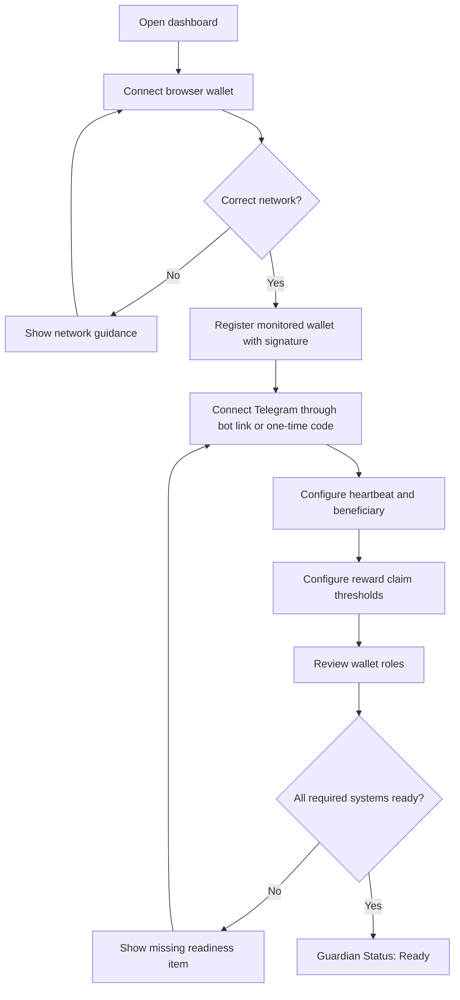
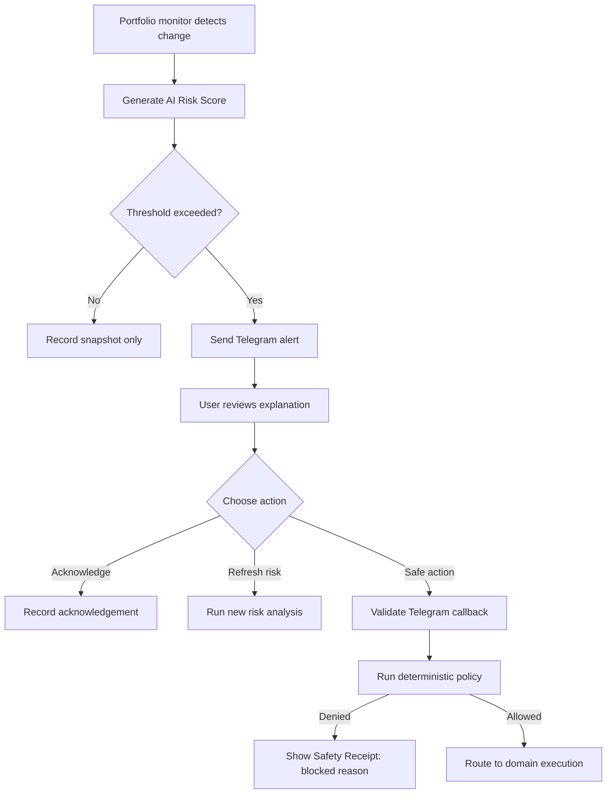
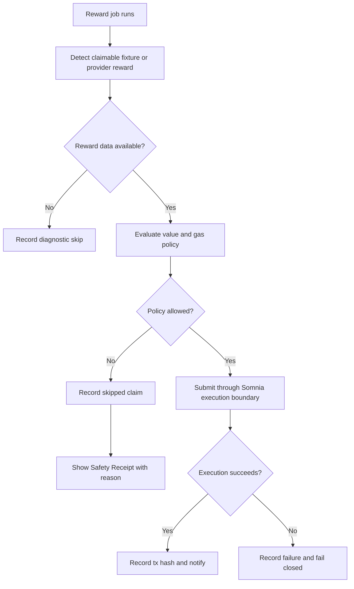
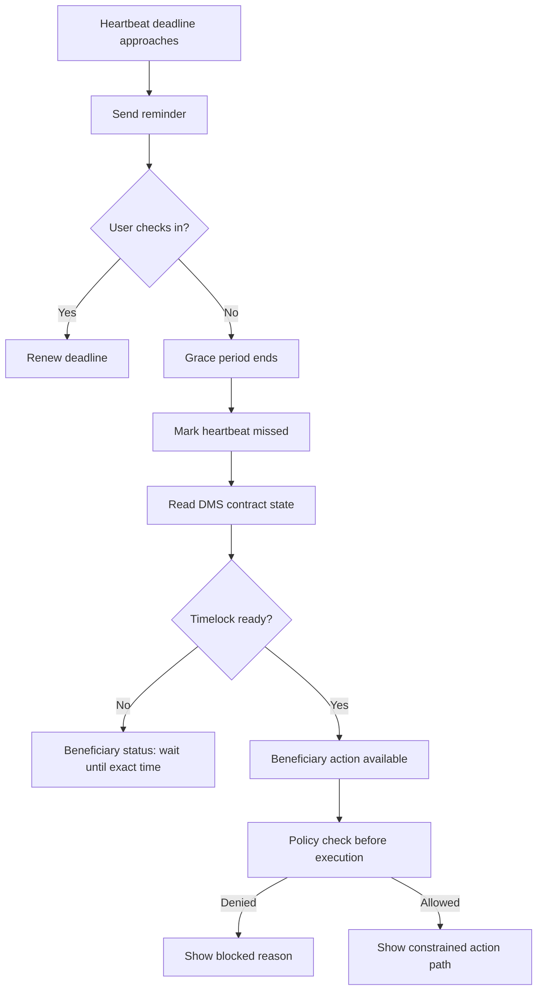
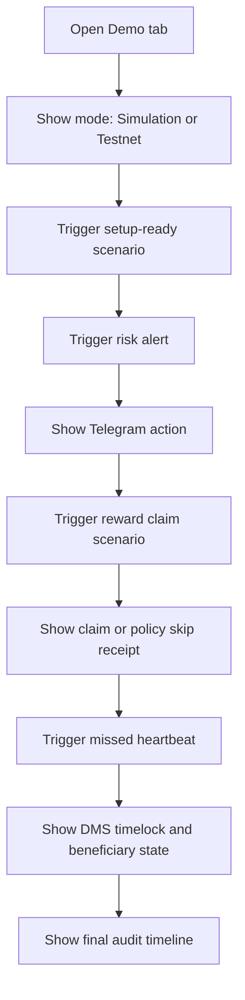

---
stepsCompleted:
  - step-01-init
  - step-02-discovery
  - step-03-core-experience
  - step-04-emotional-response
  - step-05-inspiration
  - step-06-design-system
  - step-07-defining-experience
  - step-08-visual-foundation
  - step-09-design-directions
  - step-10-user-journeys
  - step-11-component-strategy
  - step-12-ux-patterns
  - step-13-responsive-accessibility
  - step-14-complete
lastStep: 14
workflowStatus: complete
completedAt: '2026-05-14'
lastUpdated: '2026-05-15'
inputDocuments:
  - _bmad-output/planning-artifacts/prd.md
  - _bmad-output/planning-artifacts/prd-validation-report.md
revisionDocuments:
  - _bmad-output/planning-artifacts/sprint-change-proposal-2026-05-14.md
  - _bmad-output/implementation-artifacts/epic-7-context.md
  - _bmad-output/implementation-artifacts/spec-full-epic-7.md
  - _bmad-output/implementation-artifacts/7-6-redesign-dashboard-ia-telegram-connect-and-public-chain-config.md
---

# UX Design Specification Somnia RiskGuard Agent

**Author:** tug
**Date:** 2026-05-14

---

<!-- UX design content will be appended sequentially through collaborative workflow steps -->

## Executive Summary

### 2026-05-15 Revision Alignment

This revision aligns the UX specification with Epic 7 and Story 7.6. The dashboard must now be treated as a focused multi-section operational app, not a single page that accumulates every workflow. Desktop uses a persistent left sidebar. Mobile uses a bottom navigation bar with a More sheet or menu for lower-frequency sections. Overview summarizes guardian state and next safe action; detailed setup, risk, heartbeat, reward, receipt, demo, and health workflows live in their own sections.

Telegram setup must be a Connect Telegram flow, not a manual chat-id form. The primary user path should use a bot deep link, one-time code, QR/link fallback, or equivalent callback flow, with waiting, connected, expired, failed, disconnect, and reconnect states. Direct chat-id entry may exist only as an internal or legacy fallback.

Account and session behavior must feel like a normal web app. The UI must explicitly handle restoring, connected, disconnected, expired, error, and disconnecting states. Disconnect or sign out must clear wallet-specific dashboard state so one wallet's risk, setup, receipt, and demo state does not bleed into another wallet session.

Public chain metadata is part of UX because users and operators need consistent mode, network, explorer, currency, and contract labels. Chain id, public RPC URL, explorer URL, native currency, and public contract addresses should come from `config/public-chains.json`; secrets and credentials remain environment-driven.

The component model should default to shadcn/ui-style primitives or local wrappers for navigation, forms, account menus, dialogs, sheets, tabs, tables, badges, alerts, tooltips, toasts, skeletons, and loading/error states.

### Project Vision

Somnia RiskGuard Agent is a safety-first Web3 guardian for users who cannot continuously monitor their Somnia wallets. The UX must make constrained autonomy feel understandable and trustworthy: the agent watches portfolio risk, explains what matters, sends Telegram actions, claims only bounded rewards, and exposes heartbeat and Dead Man's Switch states without implying unrestricted control or financial advice.

### Target Users

The primary user is a crypto holder or DeFi participant who understands wallets and on-chain activity but does not want to watch dashboards constantly. A second critical user is the beneficiary, who may be less technical and needs calm, plain-language guidance during Dead Man's Switch activation. A third user is the developer/operator demonstrating and troubleshooting the Agentathon flow, who needs deterministic scenarios, subsystem health, and secret-safe diagnostics.

### Key Design Challenges

The UX must communicate complex safety states without overwhelming users: AI Risk Score, Telegram actions, reward policy gates, heartbeat deadlines, timelocks, beneficiary availability, and transaction outcomes. It must clearly separate browser wallet identity from backend agent execution, and distinguish simulation/demo behavior from Somnia Testnet-backed behavior. It also needs to make denied or skipped actions feel like a safety feature rather than a product failure.

### Design Opportunities

RiskGuard can stand out by using a clear guardian-status model that shows whether monitoring, alerts, heartbeat protection, reward automation, and contract state are ready. Beneficiary flows can become a trust-building moment through plain language, exact return times, and constrained actions. Demo mode can make the product story easy to judge by exposing deterministic triggers and safety receipts for every alert, skip, claim, and Dead Man's Switch state transition.

## Core User Experience

### Defining Experience

The core experience is Guardian Status Review: users should instantly understand whether RiskGuard is configured, monitoring, safe to act, blocked by policy, or waiting for a timed condition. The dashboard and Telegram messages should reduce complex agent behavior into clear status, reason, and next-step language.

### Platform Strategy

The MVP should be a responsive web app supported by Telegram action flows. The web app must use a dashboard shell, not a single overloaded page: desktop uses a persistent left navigation rail/sidebar, while mobile uses a bottom navigation bar with compact route labels and icons. The Overview route is the status summary surface; setup, risk, heartbeat, rewards, Safety Receipts, demo controls, and operator health live in focused sections so the product remains manageable as features grow.

### Effortless Interactions

Users should not need to inspect logs to know whether the system is working. Readiness, risk state, heartbeat deadline, reward claim result, and beneficiary availability should be visible at a glance. Every skipped or denied action should explain why in plain language. Simulation and Somnia Testnet-backed behavior should be explicitly labeled wherever action results appear.

### Critical Success Moments

The first success moment is completing setup and seeing the guardian become ready. The second is receiving a risk or heartbeat message that gives a clear next action without dashboard hunting. The third is seeing a reward claim or policy skip recorded as a safety receipt. The fourth is the beneficiary path explaining timelock state and return time without requiring Web3 expertise.

### Experience Principles

- Status before controls: show whether the system is safe, ready, blocked, or waiting before asking users to act.
- Explain refusals as protection: skipped claims and denied actions should feel intentional, not broken.
- Separate identities clearly: browser wallet, agent wallet, beneficiary wallet, and contract address must never blur together.
- Make time visible: heartbeat deadlines, grace periods, timelocks, and return times should be concrete and readable.
- Label reality mode: simulation, demo fixture, and testnet-backed states must be visibly distinct.

## Desired Emotional Response

### Primary Emotional Goals

The primary emotional goal is calm confidence. Users should feel that RiskGuard is awake, bounded, and understandable. The product should create the sense that a protective system is watching important conditions and will act only inside visible, configured limits.

### Emotional Journey Mapping

During first setup, users should feel oriented and increasingly protected as wallet, Telegram, heartbeat, reward policy, and contract readiness move into place. During monitoring, users should feel informed rather than interrupted. During risk alerts or reward claim outcomes, users should feel that the agent is useful but still constrained. During missed heartbeat and beneficiary flows, users should feel calm, guided, and protected from accidental action. When something fails, users should feel that the system failed closed and left a clear diagnostic trail.

### Micro-Emotions

RiskGuard should consistently push users toward confidence over confusion, trust over skepticism, relief over anxiety, and satisfaction over surprise. Beneficiaries should feel guided rather than responsible for interpreting Web3 mechanics. Operators should feel equipped rather than forced to inspect raw logs. Judges should feel that the autonomy is real enough to matter and constrained enough to trust.

### Design Implications

To create calm confidence, the UI should use plain-language status labels, visible readiness checks, concrete timestamps, and short explanations for every action outcome. To create trust, the UI should show which wallet identity is involved and why the agent did or did not act. To prevent anxiety, Dead Man's Switch states should use neutral language, grace/timelock explanations, and exact return times. To prevent suspicion, simulation/demo/testnet states must be labeled at the point of action.

### Emotional Design Principles

- Calm over dramatic: avoid alarmist language except for genuinely urgent states.
- Trust through receipts: every action, skip, denial, and failure should have a visible reason.
- Guidance over control overload: offer the next safe step, not a menu of dangerous options.
- Plain language at stressful moments: beneficiary and missed-heartbeat states should avoid protocol jargon.
- Honest automation: make the agent's limits as visible as its capabilities.

## UX Pattern Analysis & Inspiration

### Inspiring Products Analysis

RiskGuard should borrow clarity patterns from Rabby Wallet, Safe, Vercel, incident tooling, and Telegram bots. Rabby is useful for explaining transaction consequences before action. Safe is useful for role and signer clarity. Vercel is useful for calm system readiness and environment labeling. Incident tools are useful for timeline-based status. Telegram bots are useful for compact, action-oriented flows outside the dashboard.

### Transferable UX Patterns

The dashboard should use pre-action explanations, wallet-role labels, environment badges, and safety receipts. User wallet, agent wallet, beneficiary wallet, and contract address should appear as distinct identities with distinct responsibilities. Reward claims, policy skips, heartbeat reminders, and Dead Man's Switch transitions should appear in a timeline so users and judges can reconstruct what happened without reading logs.

For inheritance setup, the UX should center the smart-account authority model clearly:

- Smart-account inheritance: assets remain in a Somnia/Thirdweb smart account the user can use daily, while a bounded inheritance policy can transfer native and ERC-20 assets after missed heartbeat conditions.
- The UI must not ask users to deposit their full balance into a locked vault, because that conflicts with day-to-day wallet usage.

The smart-account path should explain that gasless/sponsored transactions may reduce setup and check-in friction, but do not replace explicit spending permissions. Users should see exactly which smart account, beneficiary, executor/module, token/native limits, heartbeat deadline, and cancellation path are active.

### Anti-Patterns to Avoid

Avoid trading-terminal density, opaque AI confidence, ambiguous wallet authority, alarmist emergency wording, and hidden simulation state. The interface should never make constrained automation look like unrestricted trading or custody. It should also avoid burying policy denials in logs, because denials are part of the safety value proposition.

### Design Inspiration Strategy

Adopt wallet-role clarity from Safe, action explanation from Rabby, environment labeling from Vercel, timeline status from incident tools, and compact action prompts from Telegram bots. Adapt these patterns for a safety-first Web3 agent by emphasizing bounded autonomy, visible policy gates, and plain-language next steps. Avoid visual patterns that make the product feel like a speculative trading cockpit.

## Design System Foundation

### 1.1 Design System Choice

RiskGuard should use a themeable Tailwind and shadcn/ui-style component foundation. The product needs proven dashboard primitives, fast implementation, accessible defaults, and enough visual flexibility to create a calm safety-oriented identity.

### Rationale for Selection

A fully custom design system would slow MVP delivery and add unnecessary implementation risk. A generic enterprise system would be fast but may feel detached from the Web3 safety narrative. A themeable Tailwind/shadcn approach gives the best balance: reliable components, predictable interaction patterns, and enough control to distinguish RiskGuard from trading dashboards and speculative crypto products.

### Implementation Approach

Use standard shadcn/ui dashboard primitives: app shell/sidebar navigation, bottom navigation, buttons, icon buttons, account menu, inputs, forms, tabs, segmented controls, badges, alerts, dialogs, sheets, tables, timelines, tooltips, toasts, and compact status panels. The layout should prioritize focused sections and scanability over an all-in-one command center. Components should support readiness states, policy decisions, action receipts, wallet identities, deadlines, environment labels, and connected/disconnected account states.

### Customization Strategy

RiskGuard's visual identity should be calm, operational, and trust-focused. Use restrained color to distinguish healthy, warning, critical, blocked, pending, simulated, and testnet-backed states. Avoid dominant Web3 gradients, neon trading aesthetics, and decorative visual noise. Custom components should focus on Guardian Status, wallet identity chips, safety receipts, heartbeat timelines, beneficiary status, and demo controls.

## 2. Core User Experience

### 2.1 Defining Experience

The defining experience is understanding the guardian's decision: what RiskGuard observed, what it decided, why it acted or refused, and what safe next step is available. This should be expressed through Guardian Status and Safety Receipts that make agent behavior transparent without requiring users to read logs or inspect raw transactions.

### 2.2 User Mental Model

Users bring familiar mental models from wallets, portfolio dashboards, Telegram alerts, and transaction receipts. RiskGuard extends these patterns by introducing bounded agent decisions, policy gates, heartbeat deadlines, timelocks, and beneficiary availability. The UX must teach that skipped or denied actions are protective outcomes, not errors, and that AI analysis cannot directly authorize transactions.

### 2.3 Success Criteria

The core experience succeeds when users can understand system state from one scan, distinguish wallet roles, identify whether behavior is simulated or testnet-backed, and see a clear next safe step. A successful interaction leaves a visible receipt: what happened, why it happened, what policy or condition mattered, and whether any transaction was signed.

### 2.4 Novel UX Patterns

The key novel pattern is the Safety Receipt. It combines transaction receipt, policy explanation, and incident timeline entry into one user-readable object. Safety Receipts should exist for risk alerts, reward claims, skipped claims, heartbeat reminders, missed heartbeat states, Dead Man's Switch transitions, beneficiary availability, and failed integrations.

### 2.5 Experience Mechanics

Users begin from the dashboard, Telegram alert, or beneficiary link. The system presents a Guardian Status summary and relevant Safety Receipt. The user can take one primary safe action when available, such as acknowledge, refresh risk, check in, or review beneficiary status. If no action is safe, the UI explains why and gives a return time or diagnostic next step. Completion is marked by a timeline entry and updated status.

## Visual Design Foundation

### Color System

RiskGuard is dark-mode first with full light-mode support. The default palette should feel like a calm cybernetic sentinel: professional, intelligent, protective, and slightly technical without becoming scary. The base uses deep neutral surfaces such as `#0A0A0F`, `#111115`, and `#1A1A22`, with restrained borders and high-contrast text.

Electric Purple is the primary accent, using `#C026D3` or `#A21CAF` for premium identity, selected active states, and primary actions. Cyan/teal is the secondary accent for active monitoring, Risk Score highlights, live agent states, and subtle glow treatment. Risk colors remain semantic: red for high risk or critical failure, amber for warning or pending attention, and green for success or healthy readiness.

Purple and cyan should not become decorative gradients. They should appear as precise signals: badges, rings, focus states, small glows, selected controls, and the Risk Score visualization. Simulation, demo, and testnet states should use distinct badge treatments so users can identify reality mode at the point of action.

### Typography System

The type system should balance technical precision with operational readability. Headings may use Satoshi or Geist Mono depending on implementation availability; if Geist Mono is used, it should be reserved for short headings or technical labels rather than long prose. Body and UI copy should use Inter for clarity. Data, addresses, transaction hashes, timers, and numeric values should use JetBrains Mono with tabular numbers.

Typography should be compact and disciplined. Dashboard headings should be smaller and denser than marketing headings. Risk Score, heartbeat countdown, and critical state labels may receive stronger emphasis, but explanatory text should remain calm and readable.

### Spacing & Layout Foundation

Use an 8px spacing system with dense, precise dashboard composition. The product should borrow restraint from Linear, calm dark-mode confidence from Arc, information density from Bloomberg Terminal, and clarity from Notion. Layout should prioritize a stable app shell first: desktop sidebar, content header, account/connection controls, and route-specific content. Guardian Status, Risk Score, heartbeat timer, Dead Man's Switch state, reward automation, and recent Safety Receipts should be summarized on Overview and expanded in their dedicated sections.

Cards should be used for individual functional modules, not nested decorative containers. Panels should feel engineered and stable, with subtle borders, minimal shadows, and clear hierarchy. The dashboard can be dense, but it must not feel like a trading terminal; every dense section needs a clear purpose and scanning path.

### Accessibility Considerations

Dark mode must maintain strong contrast for body text, metadata, badges, and controls. Critical state cannot rely on color alone; every state needs a label and icon where useful. Purple and cyan glow effects must be subtle enough not to reduce readability. Wallet addresses and hashes should be truncated visually, copyable, and rendered in monospace. Time-sensitive states should use exact timestamps alongside relative countdowns.

### Signature Visual Elements

RiskGuard should have a few recognizable visual signatures: a large Risk Score circle with subtle cyan/teal glow, a heartbeat timer with shield iconography, a Dead Man's Switch status treatment using chain/shield language, and Telegram-style quick action buttons. These elements should feel serious and precise, not playful. Motion, if used, should be minimal and functional: pulsing only for live monitoring or approaching deadlines.

## Design Direction Decision

### Design Directions Explored

Six directions were explored: Guardian Command Center, Sentinel Operations Console, Demo Storyboard, Beneficiary Safe Mode, Safety Receipts Wall, and Terminal Hybrid. Together they tested dashboard-first, operator-first, demo-first, beneficiary-first, receipt-first, and technical-dense approaches.

### Chosen Direction

The recommended direction is Guardian Command Center as the primary dashboard foundation. It gives RiskGuard a clear first screen: Guardian Status, Risk Score, heartbeat, Dead Man's Switch state, reward policy, wallet identities, and recent Safety Receipts.

### Design Rationale

Guardian Command Center best balances user trust, demo clarity, and operational density. It keeps the defining experience visible: what the guardian observed, what it decided, why it acted or refused, and what safe next step exists. It also supports the cybernetic sentinel visual identity without becoming a trading terminal.

### Implementation Approach

Use Guardian Command Center as the default Overview route inside a multi-section app shell. Add dedicated routes or sections for Setup, Risk, Heartbeat, Rewards, Safety Receipts, Demo Storyboard, Beneficiary Safe Mode, and Operator Health. Reserve Terminal Hybrid density for operator diagnostics only. Do not place every module and form on the first screen.

## User Journey Flows

### Guardian Setup And Readiness

This flow turns a risky-feeling Web3 setup into a visible readiness checklist. The user should see each guardian subsystem become ready without ever entering private keys.

### Risk Alert And Safe Action

This flow keeps AI advisory output separate from deterministic action gates. Telegram is the quick action surface; the dashboard remains the audit and setup surface.

### Reward Claim Safety Receipt

Reward claiming should emphasize policy clarity. A skipped claim is a successful safety outcome when thresholds fail.

### Missed Heartbeat And Beneficiary Path

This flow should use neutral language and exact return times. It should never imply immediate catastrophe.

### Agentathon Demo Flow

The demo flow should act like a storyboard, helping judges understand the full loop without terminal context.

### Journey Patterns

All journeys should use the same pattern: entry point, readiness or state check, one primary safe action, policy or contract gate, Safety Receipt, and timeline update. Wallet roles and reality mode should be visible wherever a user could confuse who is acting or whether the result is simulated.

### Flow Optimization Principles

Minimize steps before the first clear readiness signal. Use progressive disclosure for technical details, especially wallet addresses, policy inputs, and contract state. Treat errors, skips, and denials as first-class outcomes with plain-language explanations. Keep one primary action visible at a time in Telegram and beneficiary flows.

## Component Strategy

### Design System Components

RiskGuard should rely on Tailwind and shadcn/ui primitives for app shell/sidebar navigation, mobile bottom navigation, buttons, inputs, switches, sliders, tabs, dialogs, sheets, dropdown menus, alerts, badges, tables, tooltips, form fields, panels, separators, toasts, scroll areas, skeletons, and account menus. These components cover standard dashboard interaction needs and keep implementation fast.

### Custom Components

#### App Shell Navigation

**Purpose:** Prevent feature overload by giving every major workflow a clear place.  
**Usage:** Global shell across authenticated dashboard routes.  
**Anatomy:** Desktop left sidebar, mobile bottom navigation, route title, account menu, connection status, reality-mode badge.  
**States:** Active route, collapsed desktop, mobile selected, disconnected, session restoring, API unavailable.  
**Accessibility:** Navigation landmarks, keyboard focus order, icon labels, and current-page indication.

#### Account And Session Control

**Purpose:** Make login, wallet connection, Telegram connection, and sign out/disconnect feel familiar and reliable.  
**Usage:** Header/account menu and setup flow.  
**Anatomy:** Connected wallet identity, Telegram status, menu actions, disconnect/sign out action, expired-session prompt.  
**States:** Signed out, wallet connected, Telegram connected, partially configured, restoring, expired, disconnecting, failed.  
**Accessibility:** Menu actions must be keyboard reachable and have explicit text labels.

#### Telegram Connect Panel

**Purpose:** Bind Telegram without requiring users to know or type a chat id.  
**Usage:** Setup route and account/notification settings.  
**Anatomy:** Connect button, bot deep link, one-time code or QR/link fallback, connected Telegram identity, reconnect and disconnect actions.  
**States:** Not connected, code generated, waiting for bot confirmation, connected, expired, failed, disconnected.  
**Accessibility:** Code is copyable, status is text-labeled, and instructions are concise.

#### Guardian Status Panel

**Purpose:** Summarize whether the guardian is ready, monitoring, blocked, waiting, or failed closed.  
**Usage:** Primary dashboard entry point.  
**Anatomy:** Overall state badge, environment badge, readiness summary, next safe action, latest Safety Receipt link.  
**States:** Ready, monitoring, policy blocked, timelock pending, action available, failed closed, unconfigured.  
**Accessibility:** State must be text-labeled and not color-only.

#### Risk Score Circle

**Purpose:** Make portfolio risk immediately visible without turning the UI into a trading terminal.  
**Usage:** Dashboard hero and risk alert detail.  
**Anatomy:** Numeric score, severity label, subtle glow ring, trend indicator, explanation link.  
**States:** Low, medium, high, critical, unavailable, refreshing.  
**Accessibility:** Score and severity must be readable as text.

#### Wallet Role Chip

**Purpose:** Prevent confusion between monitored wallet, agent wallet, beneficiary wallet, and contract address.  
**Usage:** Setup review, Safety Receipts, DMS status, reward claim details.  
**Anatomy:** Role label, truncated address, copy action, optional verified/unknown state.  
**States:** Valid, missing, copied, mismatch, unverified.

#### Safety Receipt

**Purpose:** Explain what the agent observed, decided, did or refused, and what happens next.  
**Usage:** Risk alerts, reward claims, skipped claims, policy denials, heartbeat reminders, DMS transitions, failures.  
**Anatomy:** Status, event type, reason, policy/contract condition, wallet roles, tx hash when available, next step.  
**States:** Sent, acknowledged, skipped, denied, attempted, succeeded, failed, pending.  
**Accessibility:** Receipts must be navigable as timeline/list items.

#### Heartbeat Timer

**Purpose:** Show heartbeat safety timing in human-readable form.  
**Usage:** Dashboard, setup confirmation, Telegram reminder context.  
**Anatomy:** Relative countdown, exact deadline, grace end, timelock end, check-in action.  
**States:** Healthy, reminder due, expired, grace active, timelock pending, executed.

#### Dead Man's Switch Status

**Purpose:** Explain DMS state without panic or protocol jargon.  
**Usage:** Dashboard and beneficiary view.  
**Anatomy:** State badge, plain-language explanation, return time, beneficiary wallet, available action.  
**States:** Unconfigured, armed, expired, timelock pending, beneficiary available, executed, unavailable.

#### Reward Policy Summary

**Purpose:** Show whether auto-claim can run and why it did or did not act.  
**Usage:** Dashboard reward module and settings review.  
**Anatomy:** Enabled flag, minimum reward value, maximum gas, latest claim or skip receipt.  
**States:** Disabled, eligible, skipped, attempted, succeeded, failed, provider unavailable.

#### Demo Scenario Control

**Purpose:** Let operators trigger deterministic Agentathon states.  
**Usage:** Demo tab only.  
**Anatomy:** Scenario buttons, current scenario state, mode label, reset control.  
**States:** Idle, running, succeeded, failed, unavailable.

#### Safety Timeline

**Purpose:** Give users and judges a readable history of agent behavior.  
**Usage:** Dashboard main screen and detailed audit view.  
**Anatomy:** Ordered Safety Receipts with filters by type/status.  
**States:** Empty, filtered, loading, populated.

#### Subsystem Health Row

**Purpose:** Show operational readiness without exposing secrets.  
**Usage:** Dashboard header or operator tab.  
**Anatomy:** LLM, Telegram, RPC, signer, contracts, storage health badges.  
**States:** Healthy, degraded, unavailable, misconfigured.

### Component Implementation Strategy

Build custom components from design-system primitives and shared tokens. Prioritize status clarity, keyboard accessibility, and dense dashboard composition. Every custom component should support dark and light mode, semantic state labels, and copy-safe handling for wallet addresses and transaction hashes.

### shadcn/ui Component Plan

#### Components And Variants

Use project-local shadcn/ui-style primitives as the default implementation vocabulary. The dashboard shell should use a `Sidebar` or local sidebar wrapper on desktop, a bottom navigation composition on mobile, `Sheet` for More navigation, `DropdownMenu` for the account menu, `Button` variants for primary/secondary/destructive/ghost actions, `Badge` variants for mode and status labels, `Alert` for blocked or failed-closed states, `Tabs` for local route subviews, `Table` for receipt and health detail views, `Dialog` or `Sheet` for confirmation and connection flows, `Tooltip` for icon-only controls, `Toast` for short-lived action feedback, `Skeleton` for loading summaries, and `Form`, `Input`, `Select`, `Switch`, and numeric inputs for setup configuration.

Product-specific compositions should wrap those primitives: App Shell Navigation, Account And Session Control, Telegram Connect Panel, Guardian Status Panel, Risk Score Circle, Wallet Role Chip, Safety Receipt, Safety Timeline, Heartbeat Timer, Dead Man's Switch Status, Reward Policy Summary, Demo Scenario Control, and Subsystem Health Row.

#### Interaction States

Every route and major component must cover loading, empty, ready, pending, disabled, error, failed-closed, and API-unavailable states where relevant. Account controls must cover signed out, restoring, connected, disconnected, expired, disconnecting, failed, and wallet-switch states. Telegram Connect must cover not connected, code generated, waiting for confirmation, expired code, connected, failed, disconnecting, disconnected, and reconnecting. Execution-capable actions must show adapter-disabled, simulation-backed, demo-fixture-backed, and Somnia Testnet-backed states at the point of action.

#### Responsive Behavior

Desktop uses persistent left navigation with Overview, Setup, Risk, Heartbeat, Rewards, Receipts, Demo, and Health. Mobile uses bottom navigation for the highest-frequency sections and a More `Sheet` or menu for lower-frequency sections. Overview remains a summary on all breakpoints. Dense tables become compact lists on mobile, and operator health details should move behind tabs or disclosure controls.

#### Accessibility Requirements

Use semantic landmarks for the app shell, route content, and navigation. Icon-only controls need accessible labels and tooltips. Focus rings must be visible in dark and light mode. Status cannot rely on color alone; every state needs text and, where useful, an icon. Dialogs and sheets must trap focus correctly and return focus to the triggering control. Copy buttons for addresses and transaction hashes must announce success without changing layout.

#### Implementation Location Hints

Reusable primitives belong in `frontend/src/components/ui`. Product compositions belong under `frontend/src/features/dashboard` and `frontend/src/features/settings`. Route composition belongs under `frontend/src/app`. Shared public chain metadata should be read from `config/public-chains.json` through typed loaders rather than duplicated constants. Frontend API calls should keep using typed response shapes and should not expose secrets or private-key material.

#### Navigation Placement

Desktop sidebar placement: Overview, Setup, Risk, Heartbeat, Rewards, Receipts, Demo, Health. Mobile bottom nav placement should prioritize Overview, Setup, Risk, Receipts, and More; More exposes Heartbeat, Rewards, Demo, and Health when space is constrained. Beneficiary mode may use a focused simplified route that inherits account and mode labeling but avoids operator-heavy navigation.

### Implementation Roadmap

Phase 1 should build App Shell Navigation, Account And Session Control, Telegram Connect Panel, Guardian Status Panel, Risk Score Circle, Wallet Role Chip, Safety Receipt, and Safety Timeline. Phase 1 also includes the public chain config display contract: all network, explorer, native currency, and public contract labels are read from `config/public-chains.json`.

Phase 2 should add Heartbeat Timer, Dead Man's Switch Status, Reward Policy Summary, and Subsystem Health Row. Phase 2 must make runtime truth visible: API unavailable, adapter disabled, simulation-backed, demo-fixture-backed, and Somnia Testnet-backed states are explicit.

Phase 3 should add Demo Scenario Control and richer operator diagnostics, including smoke/manual verification coverage for desktop navigation, mobile navigation, disconnect/sign out, Telegram Connect, public chain config loading, and mode labeling.

## UX Consistency Patterns

### Button Hierarchy

Primary buttons should be reserved for safe, currently available actions: connect wallet, save settings, check in, refresh risk, acknowledge alert, or review beneficiary status. Destructive or irreversible actions should not appear in the MVP unless policy and contract state make them explicitly available. Secondary buttons should support inspection: view receipt, copy address, view details, or open timeline. Disabled buttons should always explain why the action is unavailable.

Telegram-style quick actions should show one primary action and at most one or two secondary actions. Beneficiary flows should avoid presenting multiple ambiguous options.

### Feedback Patterns

RiskGuard should treat success, skip, denial, pending, disconnected, unavailable, and adapter-disabled states as first-class outcomes. The dashboard must allow browser-wallet disconnect, must remain usable when the agent API is unavailable, and must label whether each visible result is simulation-backed, demo-fixture-backed, or Somnia Testnet-backed. Success feedback confirms what happened and includes transaction hash when available. Skip feedback explains why no action was needed. Denial feedback explains the policy or contract rule that blocked action. Pending feedback includes exact time or condition needed. Failure feedback states that the system failed closed and records what subsystem failed.

Feedback should use both text and semantic badge/icon treatment. Color alone is insufficient. Every feedback state should be eligible to become a Safety Receipt.

### Form Patterns

Configuration forms should use progressive sections: wallet identity, Telegram connection, heartbeat/beneficiary, reward policy, and demo settings. Each form should show validation inline and use checksum-normalized wallet addresses. Telegram setup must use a connect flow through bot deep link, one-time code, QR/link fallback, or equivalent callback; do not ask the user to manually type a Telegram chat id. Numeric thresholds should include units, such as USD or seconds, and safe defaults where possible. Forms should avoid asking for private keys and should explicitly state that user private keys are never requested.

Settings forms should show a review state before or after save, clarifying monitored wallet, agent wallet, beneficiary wallet, reward thresholds, and heartbeat timing.

### Navigation Patterns

The main dashboard should use Guardian Command Center as the default Overview route inside an app shell. Desktop navigation uses a left sidebar with Overview, Setup, Risk, Heartbeat, Rewards, Receipts, Demo, and Health. Mobile navigation uses a bottom bar for the highest-frequency sections, with less frequent sections available from a More sheet/menu. Demo controls should be separated from normal user controls so simulated behavior does not blur into production behavior. Beneficiary mode should be accessible through a focused route or view with simplified navigation.

Within each route, tabs can organize local subviews only; tabs should not substitute for global navigation. The Guardian Status summary should remain the first visible element on Overview, while detailed forms and diagnostics move to their dedicated sections.

### Additional Patterns

Loading states should use skeletons or compact pending rows, not dramatic spinners. Empty states should explain what setup step or data source is missing. Error states should name the subsystem when safe: Telegram, RPC, LLM, signer, contract, reward provider, or storage.

Timeline filters should allow users to scan by event type and status: risk, Telegram, reward, heartbeat, DMS, policy, success, skipped, denied, failed. Wallet addresses and transaction hashes should be truncated, copyable, and paired with role labels.

Simulation, demo fixture, and Somnia Testnet-backed behavior must be labeled at the action point and in resulting receipts.

## Responsive Design & Accessibility

### Responsive Strategy

RiskGuard should be desktop-prioritized but responsive. Desktop is the primary surface for setup, Guardian Command Center, demo mode, operator health, and dense Safety Receipt review. Desktop must use persistent left navigation so users can move between workflows without scrolling through a mega-page. Wider screens should use multi-column layouts within each route: Guardian Status and Risk Score first on Overview, supporting modules beside or below, and Safety Timeline visible without deep navigation.

Tablet should preserve dashboard scanability with fewer columns and larger touch targets. The Guardian Status Panel remains first, followed by Risk Score, Heartbeat, Dead Man's Switch, Rewards, and Safety Receipts.

Mobile should focus on status and action, not full dashboard density. Mobile must use bottom navigation for primary sections and a More sheet/menu for lower-frequency areas. The first mobile view should show Guardian Status, active alert or deadline, one primary safe action, and recent Safety Receipt. Beneficiary mode must be especially mobile-friendly because Sarah may open it from a message.

### Breakpoint Strategy

Use standard responsive breakpoints:
- Mobile: `320px-767px`
- Tablet: `768px-1023px`
- Desktop: `1024px+`
- Wide desktop: `1280px+` for multi-column operator/demo layouts

Implementation should be responsive-first with desktop-enhanced layouts. On mobile, complex panels collapse into stacked sections, timelines become compact lists, and dense operator diagnostics move behind tabs or disclosure controls.

### Accessibility Strategy

Target WCAG 2.2 AA. The product handles safety, funds, deadlines, and beneficiary guidance, so accessibility is part of trust. Text contrast should meet AA in both dark and light modes. Critical states must not rely on color alone; every status needs a text label and, where useful, an icon. Focus states must be visible against dark surfaces.

Wallet addresses, transaction hashes, timestamps, and countdowns should be screen-reader understandable. Buttons must have descriptive labels, especially icon buttons for copy, refresh, acknowledge, and check-in. Telegram-style actions and beneficiary actions should avoid ambiguous labels.

### Testing Strategy

Responsive testing should cover mobile, tablet, desktop, and wide desktop. Test at least one narrow mobile viewport, one tablet viewport, one standard laptop viewport, and one wide desktop demo viewport. Accessibility testing should include keyboard-only navigation, focus order review, automated axe-style checks, contrast checks for semantic colors, and screen reader spot checks for Guardian Status, Safety Receipts, forms, and beneficiary state.

### Implementation Guidelines

Use semantic HTML landmarks for dashboard structure. Keep primary content order meaningful: Guardian Status before modules, modules before timeline, timeline before diagnostics. Use `rem` units for typography and spacing where possible. Maintain minimum 44px touch targets for mobile actions. Truncate long addresses visually but keep copy controls and accessible labels. Avoid hover-only disclosure because mobile and keyboard users need equivalent access.
